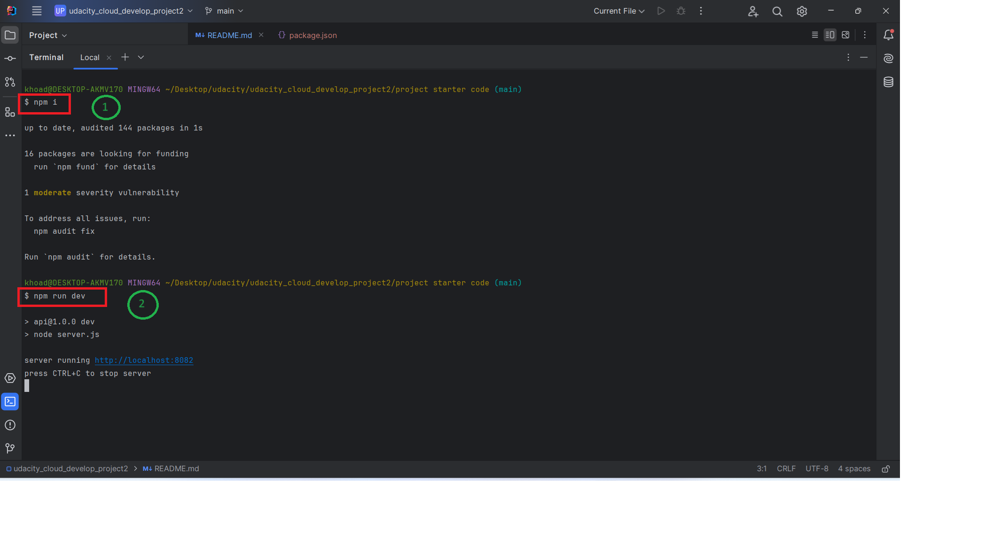
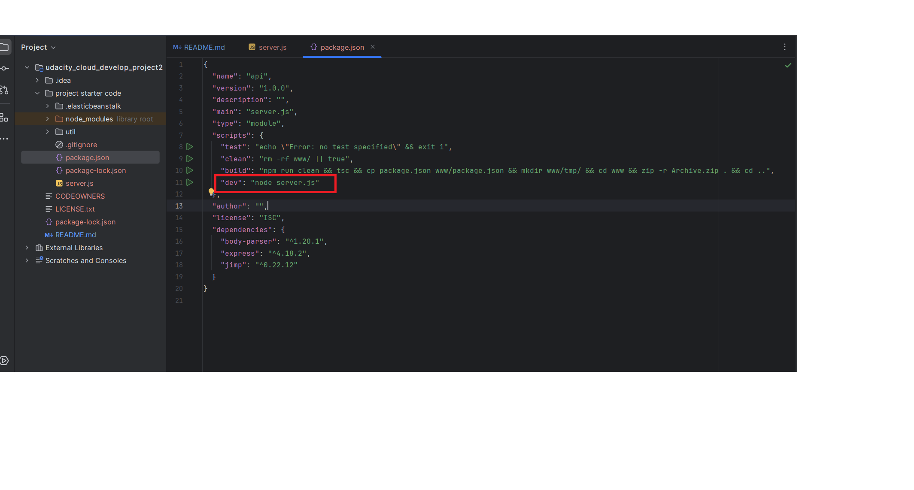
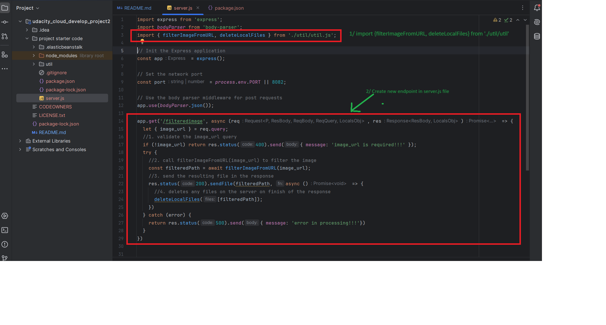
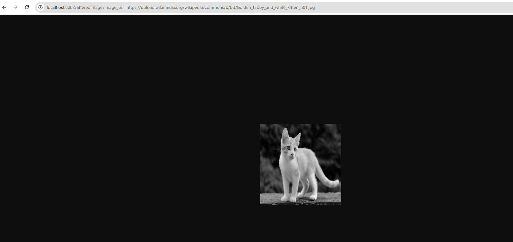
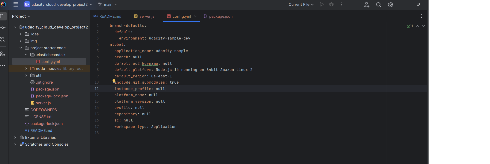
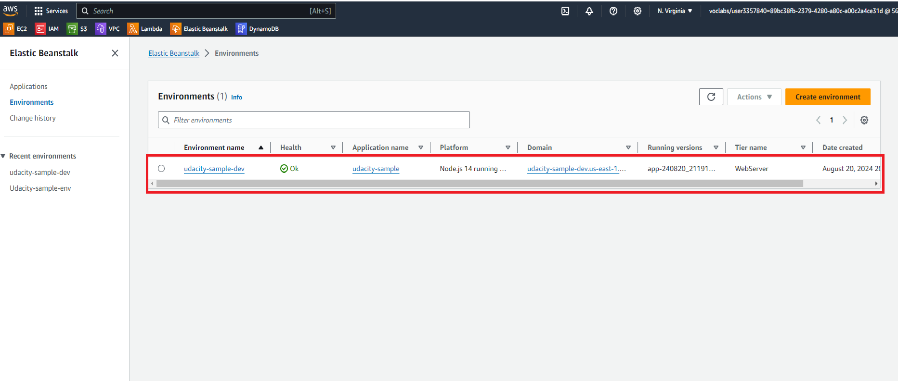
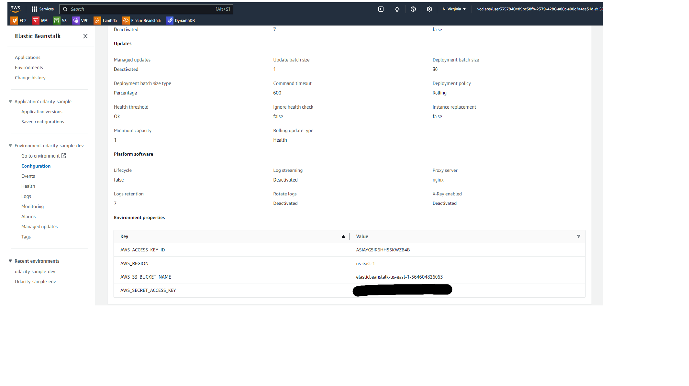
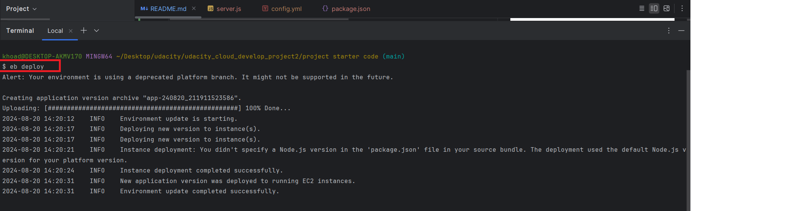
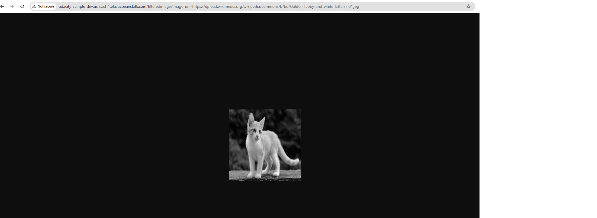

# udacity_cloud_develop_project2
## 1. Set up node environment
1. init new project => npm i
2. run dev server => npm run dev

=> To run the dev server with the npm run dev command, we need to setup as follows:

## 2. Create a new endpoint in the server.js file
### Follow the photo below, include 2 step:
- import {filterImageFromURL, deleteLocalFiles} from './util/util';
- code as required

#### => URL: http://localhost:8082/filteredimage?image_url=https://upload.wikimedia.org/wikipedia/commons/b/bd/Golden_tabby_and_white_kitten_n01.jpg
=> Result

### 3. Deploy application use Elastic Beanstalk
#### 3.1. First, use eb init to create the necessary configuration for AWS Beanstalk
=> The eb init command will create the .elasticbeanstalk/config.yml configuration file

#### 3.2: Second, eb create command to create a new environment for the Elastic Beanstalk application
=> The "eb create" create new Elastic Beanstalk environment where my application will run

=> Setup Environment properties for Updates, monitoring, and logging

#### 3.3: Thirty, eb deploy is used to deploy the latest version of the application to the current Elastic Beanstalk environment
=> Update new code and latest version of application

#### RESULT AFTER DEPLOY 
1. URL: http://udacity-sample-dev.us-east-1.elasticbeanstalk.com/filteredimage?image_url=https://upload.wikimedia.org/wikipedia/commons/b/bd/Golden_tabby_and_white_kitten_n01.jpg
2. Result image

